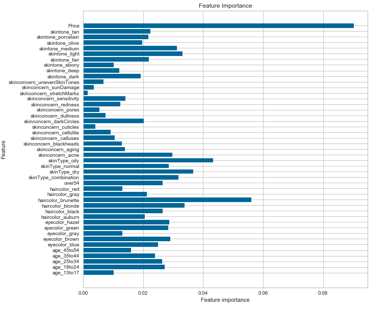

# Sephora Rating and Review Analysis

# Goal: 
My overarching goal for the project was to utilize machine learning algorithms to make predictions on product rating and recommendation based on that product's customer profiles, product description, and ingredients. Users can input user profile information about the product, or the ingredients and description of the product, and the model would be able to predict if customers will recommend that product, or if the product's average rating will be above or below average. Having the ability to make prediction allows the retailers to pre-determine product performance (at least on the product's rating or recommendation level). The beauty retail market is a $250 billion global business, roughly 56 billion in the US. However, the industry is also competitive and fast-paced. Therefore, it was interesting to explore if there are ways in which retailers or stores will be able to predict the performance of the products they want to carry in their stores. 

# Data Processing: 
Utilizing the dataset from Sephora.com, the data contained the product's name, description, brand, ingredients (if available), category, average rating, number of recommendations, as well as the all the reviewers' profiles (eye color, hair color, skincare concern, skin type etc),and the breakdown of review information (number of recommendations, star count). These were all the available features available to me to use to help make the predictive models. All data were based on Sephora.com's product information posted as of October 1, 2018.

# Data Exploration: 

### Star count by product category 

  

Analyzing the star count for each of the product categories showed that each of the categories had an overwhelmingly high number of products with 5-star counts. Therefore, any products that do not have an average review of 4 stars or above (3.99 star is the average review for all the products on Sephora.com) would be labeled as performing below average, and any product with an average review of 4 stars or above would be labeled as performing above average. 

### Product recommendation by category 
The chart below showed the break down of the different product categories carried by the company's website, it also showed that the majority of the reviewers were more likely to recommend that product. As a target for regression analysis, it would be interesting to be able to determine the percentage of customers who will recommend the products. A higher percentage of people recommending a product will be a good sign of the product's performance, as most people make purchases based on recommendations from their peers. 

  

### Customer profile review 
The boxplot visualizations of the reviewer profiles are separated by product category. The boxplots helped show the most common profile types of the reviewers on Sephora.com. According to the simple analysis, reviewers were mostly between the age range of 24-35, with brown hair, brown eyes, combination skin type, and with skin concerns related to acne or aging. The profile of the product determined the audience in which that product was targeting. 

  

### Price breakdown by product types
The graph showed that most products on Sephora.com are listed between $30 to $50.

  

### Feature correlation
By analyzing if there were any significant correlation of my remaining features, I can avoid multicollinearity, in which a one predictor variable in a multiple regression model can be linearly predicted from the others with a substantial degree of accuracy. According to the correlation map below, the price had a slightly negative impact on rating, however, a regression analysis using price as my only feature created a poor model that failed to perform better than random guessing. 

  

# Regression Analysis (using customer profiles to predict if customers will recommend a product) 
### GradientBoostingRegressor(n_estimators=400, max_features='sqrt') 
Using gradient boosting regressor, the model was able to make a relatively accurate prediction on the percentage of users who will recommend a product. The features for the models are the customer profiles information, and the strongest feature for this model was the price. 

  
  

# Classification Analysis 
### Using customer profiles to predict if a product's rating will be above or below average
### AdaBoost classifier(n_estimators=150)
Using AdaBoost classifier, I tried to predict, given the customer profiles of a product, if a product will have an above average or below average rating. The model was good at making a true positive prediction of a product performing above average, however, it had a poor performance at making an accurate prediction at a product performing below average.

  
  

### Using product description and ingredients to predict if a product's rating will be above or below average
Also note, to reduce the high dimensionality of vectorized text data, features were limited to the top 900 words under TFIDF vectorization. Multiple regularizations were tested, however, limiting features was the most effective method in this experiment.

### MultinomialNB(alpha=10)
A Naive Bayes Multinomial classifier with product description and ingredients as my features, the model had a more balanced performance. The model performed well at making a true positive prediction on products performing above average, and compared to the AdaBoost classifier, it had a better performance at predicting product performing below average 

  
  

### Deep Learning 
For features that have inherently high complexity (such as text), I also tried a deep learning approach to test if the model would be able to capture the context of the description and the ingredients and make a better prediction on rating performance. Although the deep learning model performs better at around 64% accuracy, the model was easily overfitted. The deep learning model performance peaked at around 8 epochs. 

  
  

# Bonus - Recommendation Engine
Furthermore, I was able to leverage the rich text data to create a recommendation engine based on the product's ingredient and description. A snapshot of the recommendation engine demonstrated below showed the first item listed as the product searched, and the remaining items were products recommended by the engine. Additionally, I had incorporated a selenium web browser function to automatically pull up the link to the product the recommendation engine recommend the most. 

  

# Next Steps: 
* Break down predictions by the product categories. 
* Cluster client types for each of the product, and use the clustered customer as my features to improve prediction. 
* Further analysis on why certain products do not perform well. As all the products available on Sephoar.com are inherently selling products, I did not have enough data on products that performed poorly.  
* Create a recommendation engine that also incorporates a price component, so the recommendation engine will recommend products that are similar to the search item but at a lower price point. 

